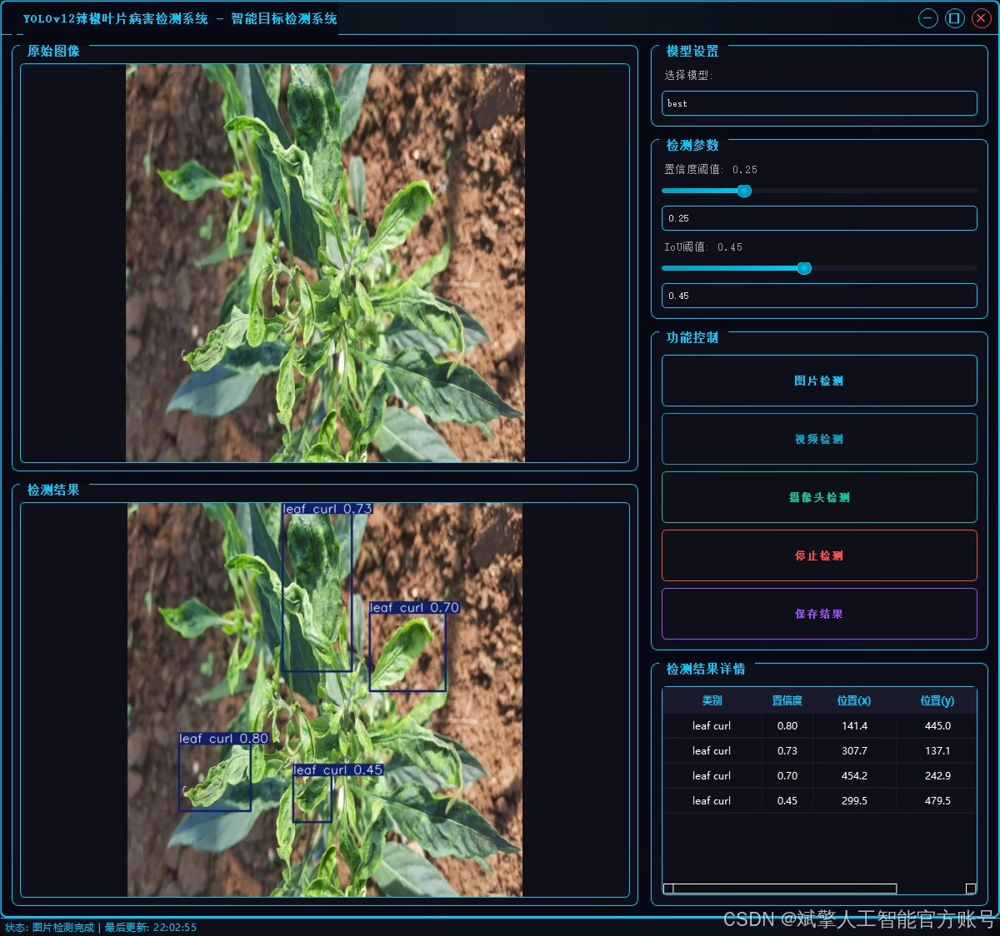
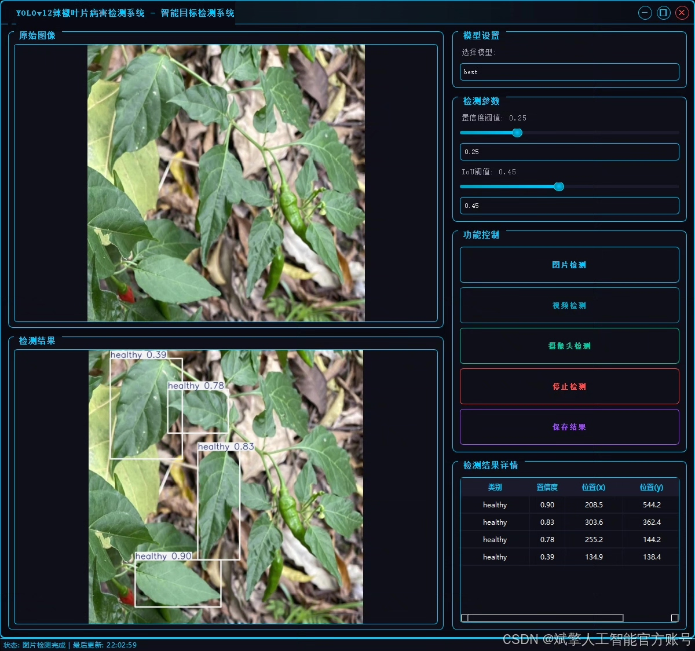
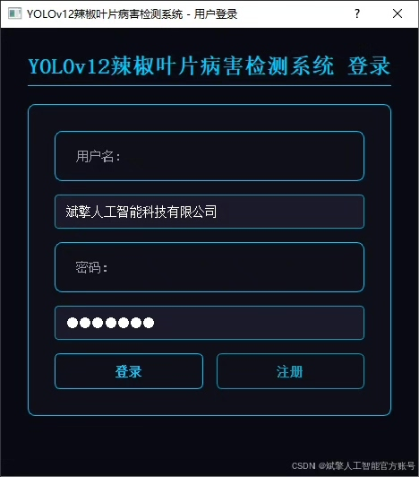
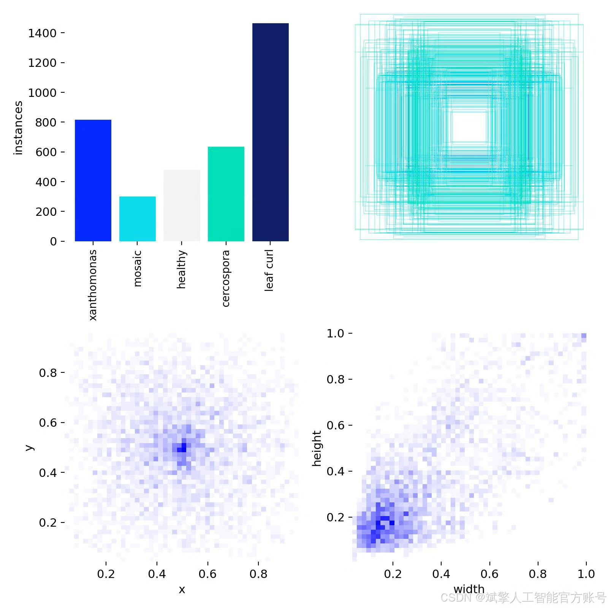
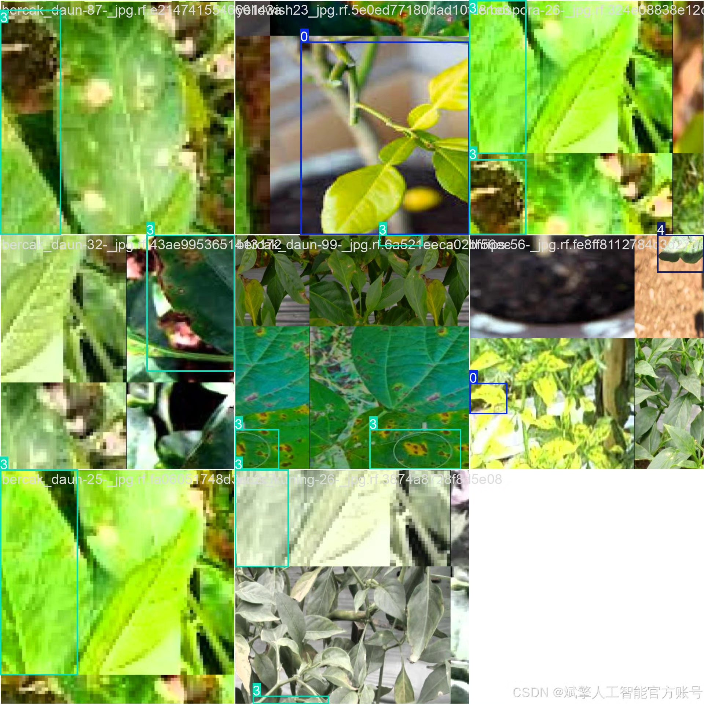
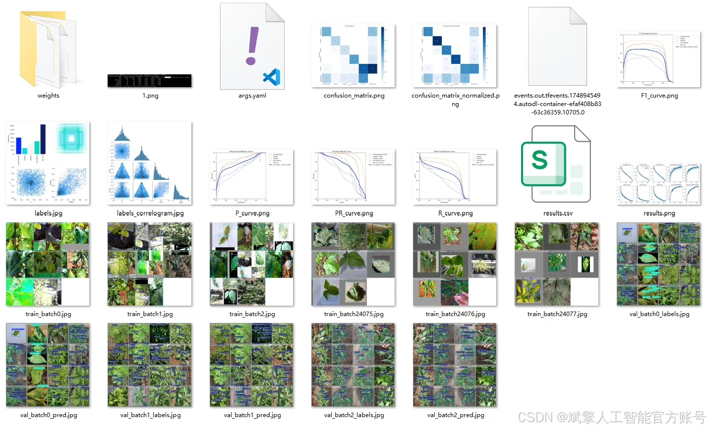
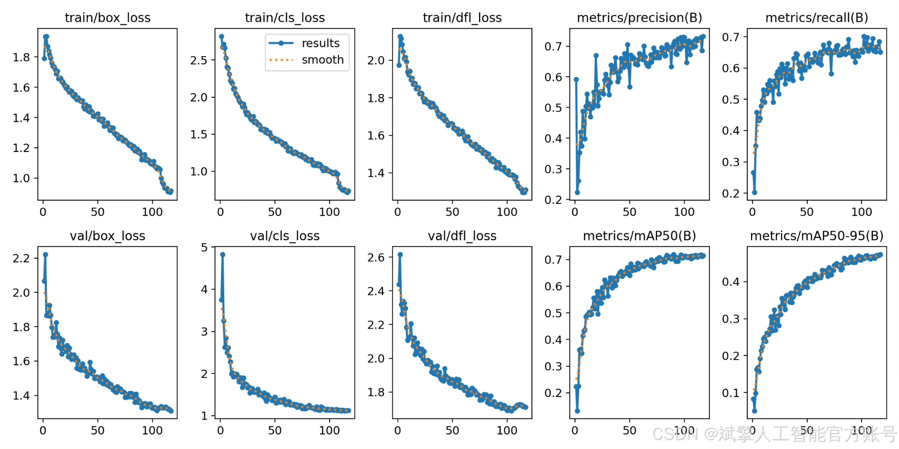
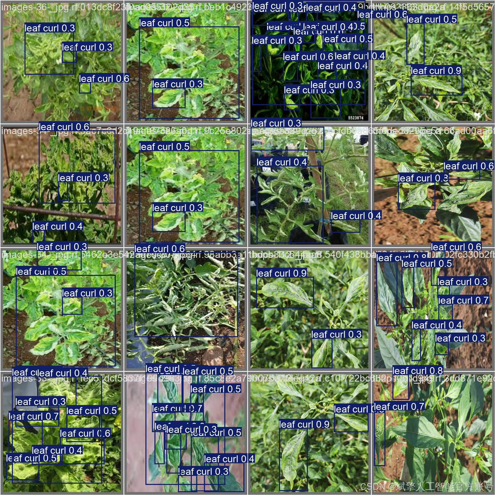

# YOLOv12 Chili Disease Identification System

## Body

YOLOv12 Tomato Disease Identification System Based on Deep Learning YOLOv12: A Smart Disease Identification System for Tomato Leaf Diseases (YOLOv12+YOLO dataset + UI interface + login and registration interface + Python project source code + model)

Tomato leaf diseases pose a severe threat to agricultural production. Traditional disease identification methods rely on manual experience, which is inefficient and prone to errors. This paper proposes a smart disease identification system based on deep learning technology for tomato leaf diseases, achieving efficient and accurate disease detection. The system targets five common tomato leaf diseases (Xanthomonas, Mosaic, Healthy, Cercospora, Leaf Curl), using a self-built YOLO format dataset containing 1796 training images and 462 validation images for model training. The system integrates a user-friendly UI interface, supports login and registration functions, and implements an end-to-end disease detection process through Python. Experiments show that the YOLOv12 model exhibits high accuracy and robustness in tomato disease identification tasks, providing a feasible solution for intelligent management of agricultural diseases.

✅ User Login and Registration: Supports password verification and security validation.
✅ Three Detection Modes: Based on the YOLOv12 model, supporting image, video, and real-time camera detection, with precise target recognition.
✅ Dual-Screen Comparison: Displays the original scene and detection results on the same screen.
✅ Data Visualization: Real-time table displaying the category, confidence, and coordinates of detected targets.
✅ Intelligent Parameter Tuning: Offers a confidence slide bar to dynamically optimize detection accuracy, adapting to different scene requirements.
✅ Sci-Fi Interactive Interface: Dark theme combined with dynamic light effects, reducing visual fatigue and enhancing operational experience.

## Images

## Payment

Here is a pay link on Stripe ( https://buy.stripe.com/3cs8yP7sY87d0vu9AB ). Please contact me lonlonago@foxmail.com after funding $89, and I will send you a complete data files , thank you!

